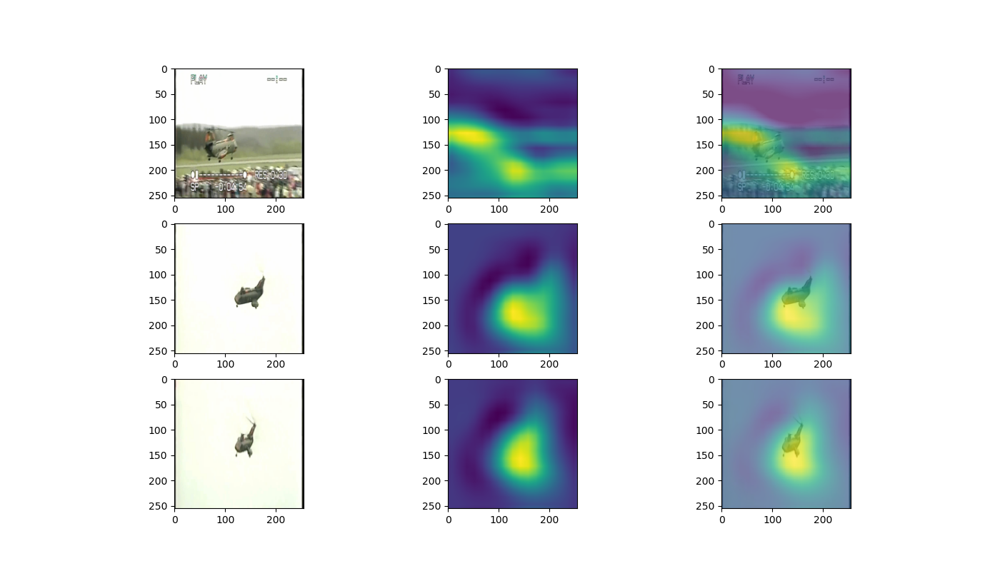
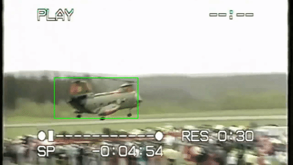

# Object Tracking with Siamese Networks implemented in Tensorflow

## Description of Product and Model Architecture
Object tracking is a specific field within computer vision that aims to track objects as they move across a series of video frames. The goal of object tracking is to train a model and estimate the target object present in the scene from previous frames. We completed this by taking a starting bounding box coordinate and creating a unique ID for each of the initial detections of the object and tracking them as they move while keeping the unique ID of each object. The specific learning model we used is a Siam-FC model with an AlexNet backend. The model takes in an instance image, and a search image, and uses the backend to process each image into a embedding, then uses cross-correlation to find the search image in the instance image. This project uses the [Lasot]
(http://vision.cs.stonybrook.edu/~lasot/) dataset.

Siamese networks differ from most neural networks in that instead of classifying the inputs, they differentiate between two inputs. Siamese networks consist of two neural networks that are from the same class and have the same weights. Those networks are then fed an image pair, which are then fed into a cross entropy loss function that calculates the similarity of two inputs, optimizing the networks.

The AlexNet architecture, illustrated above, consists of 5 Convolutional Layers and 3 Fully Connected Layers. The Convolutional Layers extract the object that corresponds to the unique ID within a given image passed through the neural network. The Fully Connected Layers use Max Pooling use pooling windows of size 3x3 with a stride of 2 between the adjacent windows in order to downsample the width and height of the tensors and keep the depth the same between windows. In addition, the Convolutional Layers each use a Rectified Linear Unit (ReLU) Activation function that clamp down any negative values in the network to 0, with positive values unchanged. The result of this function serves as the output of the Convolutional Layer.

A loss function used in this model is a cross entropy loss function. The loss is first computed by taking in two parameters of the same class, the first parameter being 1 or 0 depending on the true value of the model and the second being model's prediction for that class. The loss function then returns the mean logarithm of the negative product between the two parameters and the training code stores the weights at which at the minimum loss occurs. 

## Samples

## Youtube Video

## Directory Guide
Data_Vizualization-2.py - provides a visualization of the bounding boxes upon an image

data.download.py - downloads the data for training and annotations of the images 

data_generator.py - generates an image and constructs a score map for that image

env_checker_script.py - ensures that the correct environment was set up by the user

environment.yaml - sets up the environment for the user

image_augmenter.py - augments the image by creating the bounding boxes 

processor—visualization.py - script create to check the work on the data generator 

create_video.py - creates a video based on the test data

train.py - used to train the model

utils.py - utility file that provides functions for other files

## How to get the training started
First, you need to install the environment.yaml and activate it with anaconda.
Then, go to the [Lasot](http://vision.cs.stonybrook.edu/~lasot/) dataset, and download whatever image type you want (airplane, dog, cat, etc) and extract them into a folder called data. Then, you can add a test folder, and copy individual videos into the test folder for testing. To run the training, just run python train.py.

## Testing and Visualization Notebook
Run the python create_video.py. Just make sure you go into the create_video.py file and modify what folder you want to use in the test folder.
[Colab Notebook](https://colab.research.google.com/drive/1N6iv5DFCrvkdAvlU3xLz87_mMWimnAUk?usp=sharing)

## Citations
Bilylee. SiamFC-TensorFlow. Retrieved December 14, 2020 from https://github.com/bilylee/SiamFC-TensorFlow/tree/f572dca95f2b3b2861f54de467259753428e468c 

Huanglianghua. siamfc-pytorch. Retrieved December 14, 2020 from https://github.com/huanglianghua/siamfc-pytorch/tree/39572051d7c3d9850ca6100efa04091e18c2f706 

Jason Brownlee. 2019. A Gentle Introduction to Cross-Entropy for Machine Learning. (December 2019). Retrieved December 11, 2020 from https://machinelearningmastery.com/cross-entropy-for-machine-learning/ 

Richmond Alake. 2020. Implementing AlexNet CNN Architecture Using TensorFlow 2.0+ and Keras. (August 2020). Retrieved December 10, 2020 from https://towardsdatascience.com/implementing-alexnet-cnn-architecture-using-tensorflow-2-0-and-keras-2113e090ad98 

Sunita Nayak. 2018. Understanding AlexNet. (June 2018). Retrieved December 10, 2020 from https://www.learnopencv.com/understanding-alexnet/ 

Torrvision. siamfc-tf. Retrieved December 14, 2020 from https://github.com/torrvision/siamfc-tf 
